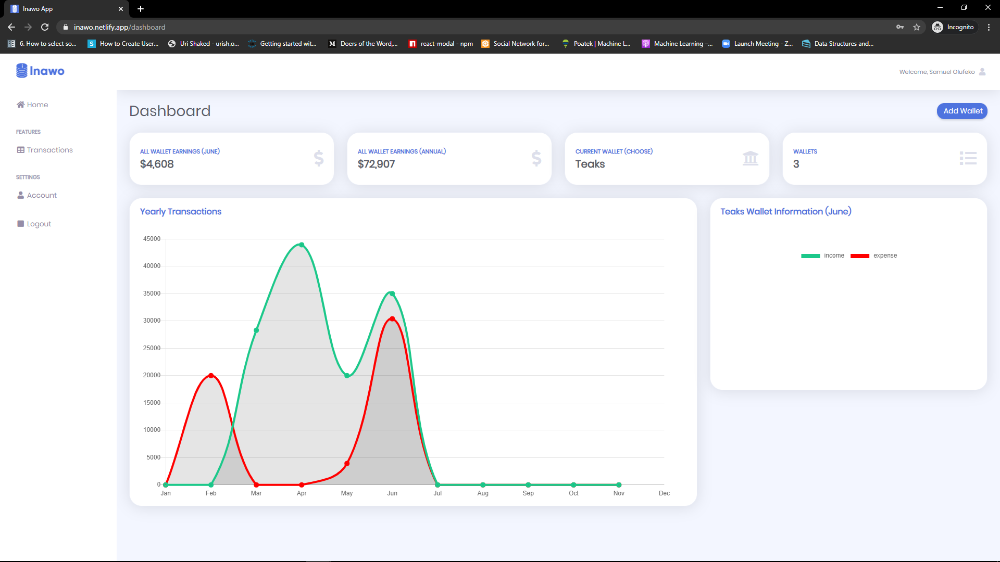

	

## Features
- authentication: signup, login
- create multiple wallets, wallets represent your normal bank accounts
- create transaction for each wallets, income or expense
- get a chart of transactions done through out the year, to help you understand your finance

## About
This a web application for a finance management system built with react and backend api built with django python, it can be found [here](https://github.com/olufekosamuel/Inawo-api).

## Quick View

## Available Scripts

In the project directory, you can run:

### `npm start`

Runs the app in the development mode. 
Open [http://localhost:3000](http://localhost:3000) to view it in the browser.

